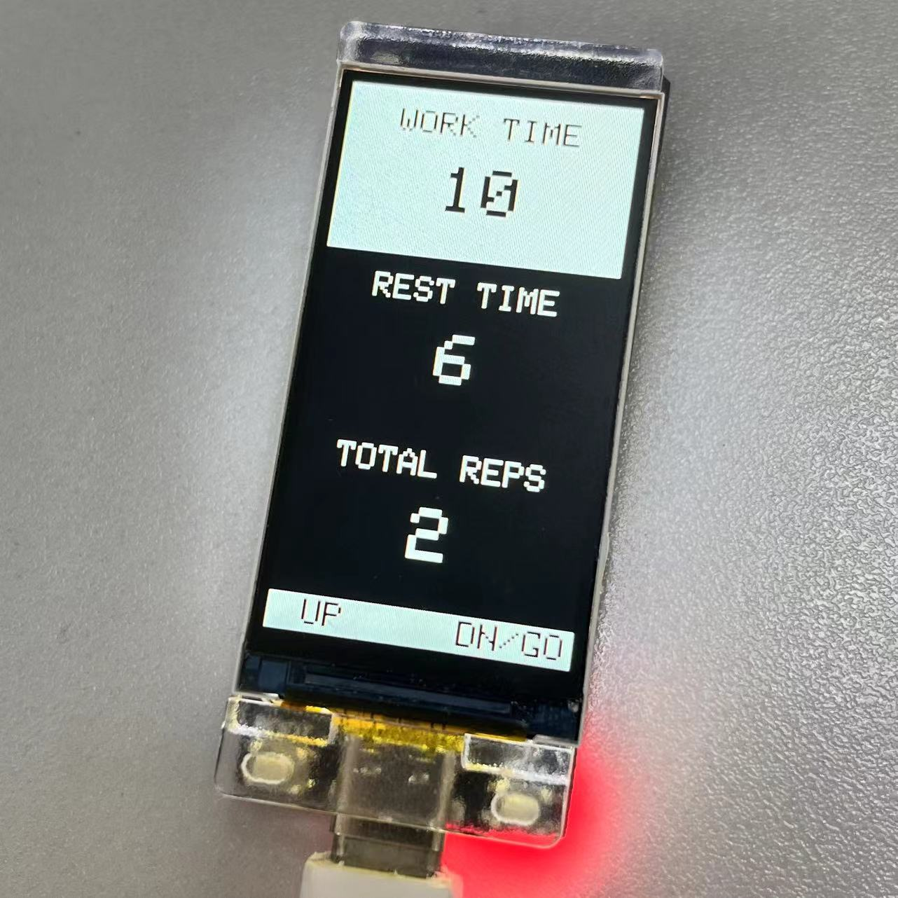
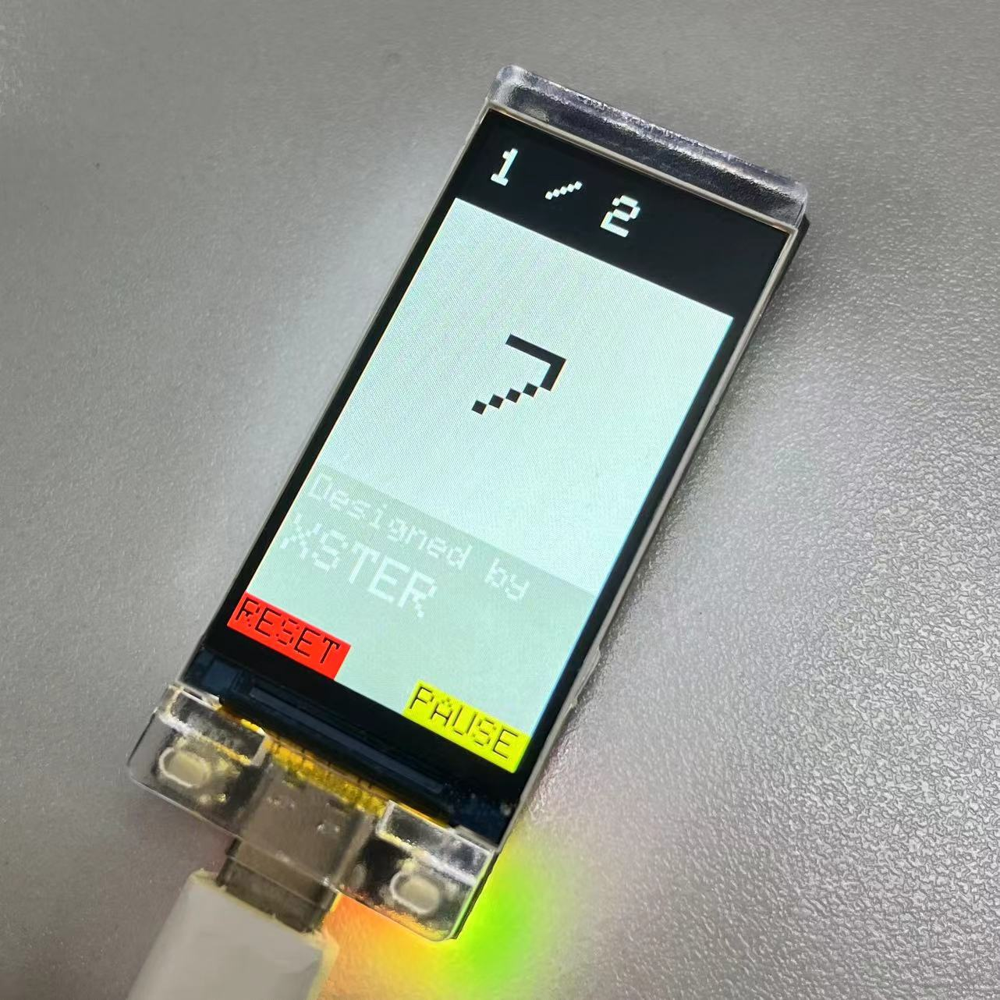

# ESP32 HIIT计时器

本项目在 ESP32 开发板上实现HIIT计时器。

## 功能特性
- MCU: ESP32-S3
- 屏幕驱动: ST7789
- 屏幕尺寸: 170 x 320

## 安装使用

1. 克隆项目到本地
2. 打开 PlatformIO 并导入项目
3. 需配置 TFT_eSPI 库中屏幕的驱动
4. 测试上传

## 更多教程
<a href="#">视频教程</a>
